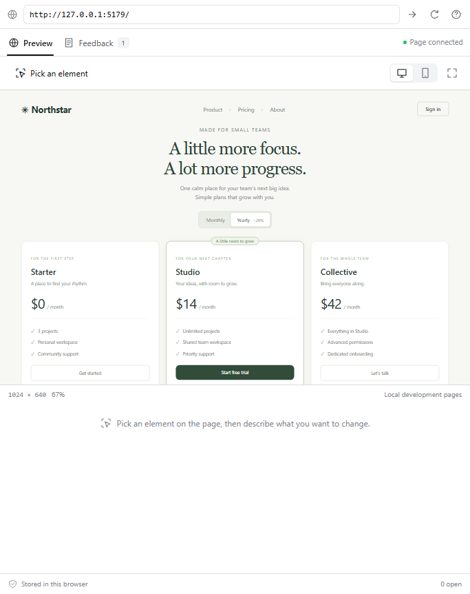
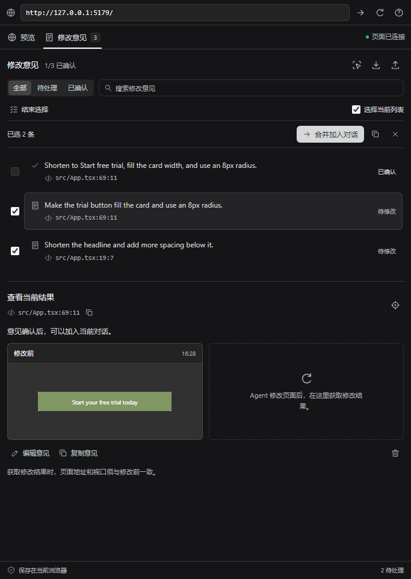

# DSH Visual Edit

**Point at a webpage. Tell your DSH agent what to change. Compare the result.**

[中文](README.zh-CN.md) · [Download v0.3.0](https://github.com/Han-1413141/dsh-visual-edit/releases/tag/v0.3.0) · [Report an issue](https://github.com/Han-1413141/dsh-visual-edit/issues)

[](https://github.com/Han-1413141/dsh-visual-edit/actions/workflows/ci.yml)
[](LICENSE)

A visual feedback sidebar for [DeepSeek Harness](https://github.com/deepseek-ai/deepseek-harness). It connects a local Vite + React page to your current conversation, with source locations and an explicit before/after review.


The screenshot shows batch feedback selection in the native sidebar of DSH **0.2.0-rc.2**. All screenshots come from the real DSH application. The demo illustrates plugin interactions, without submitting a request to a model.

## What it does

- **Pick an element:** record its JSX file, line and column, selector, text, measured styles, and a DOM-rendered PNG.
- **Add feedback to the current composer:** preserve your existing draft, review the request, and send it to your existing DSH agent.
- **Compare the result:** capture the same element at the same URL and viewport, see before/after images and measured changes, then confirm it yourself.
- **Follow DSH's appearance:** host fonts, colors, radii, and explicit light/dark or system preferences.
- **Work through feedback:** search and filter open or confirmed notes, enlarge images, and compare with an overlay slider.
- **Collect several changes:** save and pick another element, select multiple notes, and add them to one DSH draft.
- **Restore local backups:** preview an exported file and restore notes with their snapshots into the current session; existing IDs are skipped.
- **Keep a local review history:** session-scoped notes, English/Chinese UI, desktop/mobile viewports, reload persistence, JSON export, and conflict detection between browser tabs.

The preview uses your development server directly. It preserves the live iframe when the sidebar is hidden; ordinary app interactions still work outside selection mode. React state across a code change depends on your application's hot-reload behavior.

| Preview and pick | Collect and review feedback |
|---|---|
|  |  |

[Dark appearance](docs/images/batch-dark.png) · [Overlay comparison](docs/images/comparison.png)

## Quick start

Requirements: Node **22.19+ or 24+**, an initialized DSH **0.2.0-rc.2** Web profile, and a **Vite 6.4 / React** project. The release was tested with Node 24.19, Vite 6.4.3, React 18.3.1, and Chromium on Windows. See [validation](docs/validation.md) for the exact scope.

### 1. Install the DSH sidebar

Run in a terminal with DSH and pnpm available:

```sh
dsh plugin --profile web add https://github.com/Han-1413141/dsh-visual-edit/releases/download/v0.3.0/dsh-visual-edit-0.3.0.tgz
```

Restart DSH Web and refresh its browser page. Open the right sidebar and choose **Visual Edit**. Existing conversations also have a cursor icon in their header.

The plugin is distributed through **GitHub Releases**. Use the full URL above; a bare `npm install dsh-visual-edit` is not this release's installation path.

### 2. Add the development bridge to your web project

In **your Vite project's directory**:

```sh
npm install -D https://github.com/Han-1413141/dsh-visual-edit/releases/download/v0.3.0/dsh-visual-edit-0.3.0.tgz
```

Add the plugin to your existing `vite.config.ts`:

```ts
import { defineConfig } from 'vite';
import react from '@vitejs/plugin-react';
import { visualEdit } from 'dsh-visual-edit/vite';

export default defineConfig({
  plugins: [visualEdit(), react()],
});
```

The default allowed DSH origins are `http://127.0.0.1:3080`, `http://localhost:3080`, and `http://[::1]:3080`. For a different DSH port, specify its **exact origin**:

```ts
visualEdit({ allowedOrigins: ['http://127.0.0.1:3086'] })
```

The sidebar's **?** button shows configuration for the DSH origin you are currently using. Restart the Vite server after changing its configuration. The bridge and source attributes are only added during `vite serve`; production builds are unaffected.

### 3. Make a change

1. Open your local development URL in Visual Edit, for example `http://localhost:5173`.
2. Click **Pick an element**, select the element, explain the change, and save the feedback.
3. Click **Add to chat**. Review and send the inserted text from the normal DSH composer. Keep the web project selected as the DSH workspace.
4. After the agent edits the code, click **Capture result**. Compare both images and expand **Measured changes**.
5. Click **Confirm result** when you are satisfied. Use **Request another change** to revise the request; the original baseline remains until you create a new note.

“Added to composer” means the text was inserted. “Confirmed” means you clicked the confirmation button. The plugin does not infer that a model has completed or correctly implemented a request.

Saving a note opens **Feedback**. Capture briefly brings the live preview into view, then returns to the comparison; this prevents browser throttling of image rendering inside hidden frames. Click a snapshot to enlarge it or use the overlay slider. Narrow sidebars stack filters and images; **Actual size** lets you inspect small targets without scaling the viewport.

Use `Ctrl / ⌘ + Enter` to save feedback and `Esc` to cancel. If another tab updates the same note while you are editing, your unsaved text stays in the editor and saving is blocked. **Load latest note** explicitly replaces it with the latest record; copy your text first if you need both versions.

### Collect and send multiple requests

Use **Save & pick another** to keep annotating. In **Feedback**, choose **Select multiple**, check the notes, and click **Add selected to chat**. You can also copy the selected feedback.

**Select visible** selects unconfirmed notes in the current filtered list. Reopen a confirmed note before sending another request for it. The combined prompt shares one instruction block while retaining each note's source and element data. Your existing DSH draft is preserved; you still review and send it yourself.

Selection retains each note's revision. If another tab updates a selected note, clear and select it again before insertion so that unseen changes are not silently included.

### Upgrade from 0.1 or 0.2

Reinstall the sidebar and your web project's Vite bridge using the new URLs above, then restart both services. Version 0.3.0 uses the existing storage format, so notes and images remain available in the same browser, DSH origin, and session.

## Try the included demo

```sh
git clone https://github.com/Han-1413141/dsh-visual-edit.git
cd dsh-visual-edit
npm ci
npm run build
npm run demo
```

Open `http://127.0.0.1:5179` in the sidebar. The demo contains a small pricing page; try shortening the Studio button label and making it fill the card. Its Vite configuration permits the normal DSH port and the isolated test port `3086`.

## Data and access

- The host plugin registers no tools and reads no workspace files. The Vite plugin reads JSX files through Vite's normal transform pipeline and embeds **relative** source locations in development output.
- Notes and PNGs are stored in the current browser's IndexedDB, up to 50 notes per DSH session. Export downloads a JSON file including those snapshots. Different browsers and different DSH origins have separate storage.
- Only feedback explicitly added or copied goes to the agent. It includes the element's text and selected computed styles; images are excluded. Normal DSH submission uses the model/provider configured in DSH.
- Form fields, editable content, and elements marked `data-private` or `data-visual-edit-private` are excluded from captured text and imagery. URL query strings and fragments are excluded from agent feedback. A local hash of the full URL is used to detect route changes.
- The bridge accepts messages only from the configured parent origin, the matching iframe window, and a per-connection random channel. The preview accepts local HTTP(S) addresses on a different origin from DSH.

Use private markers for sensitive content displayed as ordinary page text. These exclusions are specific rules, not a general sensitive-data detector. [Architecture and data flow](docs/architecture.md).

### Back up and restore

Use **Export notes** to download JSON. In the destination session, click **Restore backup**, choose the file, review new and duplicate records, and confirm. Restoring neither opens the referenced pages nor sends content to the agent.

Notes retain comments, timestamps, source locations and before/after snapshots. Existing IDs are skipped. Previously queued notes become drafts because the destination composer may not contain their feedback. The current preview URL and viewport stay as configured. Backups exported by 0.1 and 0.2 are supported. Files are limited to 70 MB and the session remains limited to 50 notes.

Invalid records, unsupported image data and excessive image dimensions are rejected before import. Writes use one transaction: a storage failure leaves no partial import. [Restore preview](docs/images/restore-zh.png).

## Scope of v0.3

| Area | Supported behavior |
|---|---|
| Host | DSH 0.2.0-rc.2 Web client; other host versions and the Electron desktop shell are unverified |
| Web app | Local Vite 6.4 with React JSX/TSX; other frameworks are outside this release's verified scope |
| Preview | Desktop 1024 × 640 or mobile 390 × 720, scaled to fit the sidebar |
| Images | DOM-rendered element PNGs, up to 1600 × 1600 and 650,000 data-URL characters |
| Element identity | Unique selector plus tag, stable ID/test ID, and source checks where available |
| Repeated lists | Give items stable IDs or `data-testid`; positional selectors cannot establish business identity after reordering |
| Review | Original and current snapshots, text/style changes, explicit human confirmation |

Cross-origin nested iframes, shadow DOM, canvas/WebGL capture, browser-native form appearance, external fonts, remote websites, and automatic rollback are outside this version's scope. Restrictive CSP or `X-Frame-Options` may prevent embedding or DOM image generation. Image failure leaves usable source/text/style facts and a visible explanation. This is not pixel-perfect browser screenshot testing.

If source lines moved and the element has no stable ID, select it again instead of attaching a result to a possibly different element. Changed routes or viewports are rejected. [Troubleshooting](docs/troubleshooting.md).

## Development

```sh
npm ci
npm run build
npm run typecheck
npm test
npx playwright install chromium
npm run test:browser
npm run demo:build
```

On Linux, use `npx playwright install --with-deps chromium`. Browser tests use an explicitly labeled integration fixture. The native DSH check for 0.3 verified continuous picking, combined composer insertion, legacy backup restoration, duplicate handling, and light/dark appearance. Source-edit hot reload and image comparison were also verified in the 0.2 baseline. See [validation](docs/validation.md).

The built client uses DSH's React instance and stays below its 256 KiB bundle limit. `lib/` is committed so release archives work without a consumer-side build. Contributions should keep the native DSH workflow working; include a reproduction for unsupported frameworks or host versions. [Contributing](CONTRIBUTING.md).

## Why this project

Existing tools already cover browser preview, element selection, and annotation. Visual Edit focuses on source-linked feedback followed by a local comparison and a user-confirmed result within DSH. The [research note](docs/research.zh-CN.md) describes the closest projects and the reasons for this scope. It does not claim the space is empty.

MIT. [Third-party notices](THIRD_PARTY_NOTICES.md). Independent community plugin; not an official DeepSeek product.
