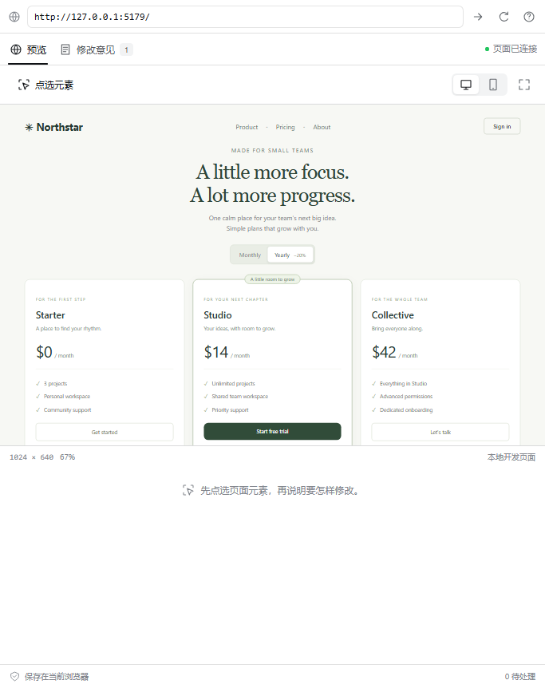

# DSH Visual Edit · 网页点选修改

**点选网页元素，把修改意见交给 DSH Agent，在原处比较结果。**

[English](README.md) · [下载 v0.2.0](https://github.com/Han-1413141/dsh-visual-edit/releases/tag/v0.2.0) · [反馈问题](https://github.com/Han-1413141/dsh-visual-edit/issues)

[](https://github.com/Han-1413141/dsh-visual-edit/actions/workflows/ci.yml)

这是 [DeepSeek Harness](https://github.com/deepseek-ai/deepseek-harness) 的网页反馈侧栏。它连接本地 Vite + React 页面，把元素、源码位置和修改意见放在一起，方便修改后逐项确认。


截图来自 DSH **0.2.0-rc.2**。演示通过实际修改源码和 Vite 热更新获取结果，展示的是插件的反馈与确认流程，不代表模型性能评测。

## 能做什么

- **点选元素，找到源码**：记录 JSX 文件、行列、选择器、文字、样式和元素外观快照。
- **加入当前对话**：保留输入框已有草稿，把意见交给你当前使用的 DSH Agent。
- **比较修改结果**：在相同页面地址和视口下获取同一元素，比较前后图片、文字和样式，再手动确认。
- **随 DSH 一起切换外观**：沿用宿主的字体、颜色和圆角，支持 DSH 的浅色、深色和系统设置。
- **集中处理意见**：搜索、筛选待处理或已确认的记录，放大快照，拖动滑块叠加比较。
- **保留修改记录**：按会话保存意见，支持中英文、桌面与手机视口、刷新恢复、JSON 导出，以及多个浏览器标签页之间的修改冲突检测。

预览直接使用开发服务器的原地址。收起侧栏时保留已经打开的页面，未开启点选时可以正常操作页面。修改代码后的 React 状态是否保留，取决于应用本身的热更新方式。

| 预览并点选 | 比较和确认 |
|---|---|
|  |  |

[深色界面](docs/images/native-dsh-dark.png) · [叠加比较](docs/images/comparison.png) · [界面设计说明](docs/ui-design.zh-CN.md)

## 安装和使用

需要 Node **22.19+ 或 24+**、已经初始化的 DSH **0.2.0-rc.2 Web** profile，以及 **Vite 6.4 / React** 项目。本次在 Windows、Node 24.19、Vite 6.4.3、React 18.3.1 和 Chromium 中验证，完整范围见[验证记录](docs/validation.md)。

### 1. 安装 DSH 侧栏

在已经能使用 DSH 和 pnpm 的终端中执行：

```sh
dsh plugin --profile web add https://github.com/Han-1413141/dsh-visual-edit/releases/download/v0.2.0/dsh-visual-edit-0.2.0.tgz
```

重启 DSH Web 并刷新浏览器。打开右侧边栏，选择“网页点选修改”；已有会话的标题栏也提供光标图标入口。

插件通过 **GitHub Releases** 分发，请使用完整下载地址。直接执行 `npm install dsh-visual-edit` 不是本版本的安装方式。Electron 桌面端尚未单独验证。

### 2. 为网页项目接入 Vite 插件

进入**你的 Vite 网页项目目录**，执行：

```sh
npm install -D https://github.com/Han-1413141/dsh-visual-edit/releases/download/v0.2.0/dsh-visual-edit-0.2.0.tgz
```

在已有的 `vite.config.ts` 中加入 `visualEdit()`：

```ts
import { defineConfig } from 'vite';
import react from '@vitejs/plugin-react';
import { visualEdit } from 'dsh-visual-edit/vite';

export default defineConfig({
  plugins: [visualEdit(), react()],
});
```

默认允许 `http://127.0.0.1:3080`、`http://localhost:3080` 和 `http://[::1]:3080` 中的 DSH 页面连接。DSH 使用其他端口时，填写实际地址的 **origin，即协议、主机和端口**：

```ts
visualEdit({ allowedOrigins: ['http://127.0.0.1:3086'] })
```

侧栏的“?”会显示适用于当前 DSH 地址的配置。修改配置后重启 Vite。接入脚本和源码属性只在开发模式加入，生产构建不包含它们。

### 3. 完成一次修改

1. 在侧栏打开本地开发地址，例如 `http://localhost:5173`。
2. 点击“点选元素”，选中页面上的目标，填写修改要求并保存。
3. 点击“加入当前对话”，在 DSH 原输入框中检查并发送。DSH 的工作区应选择该网页项目。
4. Agent 改完代码后点击“获取修改结果”，比较两张快照，并展开“实际变化”。
5. 满意后点击“确认结果”。“继续修改”会编辑这条意见，并保留最初的比较基准；需要新基准时重新点选创建意见。

“已加入输入框”只表示意见已经插入；“已确认”表示你点击了确认按钮。插件不会把这些状态当成模型已经完成任务的证明。

保存意见后自动进入“修改意见”。获取结果时会短暂显示当前预览，再返回比较页，避免浏览器暂停隐藏页面的图片生成。点击快照可放大查看或叠加比较。窄侧栏会把筛选区和图片排成上下布局；“实际大小”可按原视口浏览较小的元素。

填写意见时按 `Ctrl / ⌘ + Enter` 保存，按 `Esc` 取消。多窗口编辑发生冲突时保留你尚未保存的文字，并提供“读取最新意见”。该按钮会用最新记录替换编辑框；需要保留自己的版本时，先复制文字。

### 从 0.1.0 升级

用上方新的安装地址重新安装 DSH 侧栏和网页项目中的 Vite 插件，再重启两个服务。0.2.0 沿用原有存储格式；在相同浏览器、DSH 地址和会话中，已有意见和图片继续可用。

## 运行演示

```sh
git clone https://github.com/Han-1413141/dsh-visual-edit.git
cd dsh-visual-edit
npm ci
npm run build
npm run demo
```

在侧栏打开 `http://127.0.0.1:5179`。演示是一个定价页面，可以尝试缩短 Studio 按钮的文字、加宽按钮、修改圆角。演示配置允许 DSH 默认端口和隔离测试端口 `3086`。

## 数据保存与权限

意见和 PNG 快照保存在当前浏览器的 IndexedDB 中，每个 DSH 会话最多 50 条。导出会下载包含快照的 JSON 文件。不同浏览器、不同 DSH origin 使用各自的存储。

加入或复制给 Agent 的内容包括意见、源码位置、元素文字和选定的计算样式，不包含快照图片。最终发送仍走 DSH 中已有的模型配置。插件的服务端部分不读取工作区文件，也不增加模型工具；Vite 部分通过正常源码转换过程加入相对文件位置。

表单输入、可编辑文字，以及标有 `data-private` 或 `data-visual-edit-private` 的元素，不进入捕获的文字和图片。页面地址的查询参数和片段不加入模型提示词；完整地址的本地哈希用于判断页面是否变化。普通页面文字中的敏感内容需要你主动标记，这套规则不能自动识别所有敏感信息。

页面接入会核对来源窗口、允许的 origin 和每次连接的随机标识。预览地址限本地 HTTP(S)，不能与 DSH 同源。[实现与数据流](docs/architecture.md)。

## 当前版本的范围

| 项目 | v0.2.0 范围 |
|---|---|
| DSH | 0.2.0-rc.2 Web；其他版本及 Electron 桌面外壳未验证 |
| 网页项目 | 本地 Vite 6.4、React JSX/TSX |
| 视口 | 桌面 1024 × 640，手机 390 × 720，按侧栏大小缩放 |
| 快照 | 根据 DOM 生成的元素 PNG，最多 1600 × 1600，data URL 不超过 650,000 字符 |
| 元素定位 | 唯一选择器、标签、稳定 ID 或 test ID，以及可用的源码位置 |
| 列表元素 | 建议设置稳定 ID 或 `data-testid`；列表重排后，仅靠位置不能证明还是同一条记录 |
| 确认方式 | 比较原始与当前快照，查看文字和样式变化，手动确认 |

当前版本不覆盖跨域子 iframe、Shadow DOM、canvas/WebGL、浏览器原生控件样式、外部字体、远程网站和自动回滚。页面的 CSP 或 `X-Frame-Options` 可能限制嵌入及图片生成。图片不可用时仍保留源码、文字和样式，并显示原因；它不属于像素精确的浏览器截图测试。

源码行号变化且目标没有稳定 ID 时，需要重新点选。页面地址或视口变化会阻止获取结果。[故障处理](docs/troubleshooting.md)。

## 开发与文档

```sh
npm ci
npm run build
npm run typecheck
npm test
npx playwright install chromium
npm run test:browser
npm run demo:build
```

Linux 下安装浏览器时使用 `npx playwright install --with-deps chromium`。自动浏览器测试使用有明确标识的测试界面；另已在真实 DSH 中验证插件安装、侧栏注册、原生输入框、实际源码热更新和前后图片对比，详见[验证记录](docs/validation.md)。

- [为什么选择这个方向，以及最接近的现有项目](docs/research.zh-CN.md)
- [实现与数据流](docs/architecture.md)
- [贡献说明](CONTRIBUTING.md)
- [第三方许可](THIRD_PARTY_NOTICES.md)

MIT 协议。社区独立插件，不代表 DeepSeek 官方。
