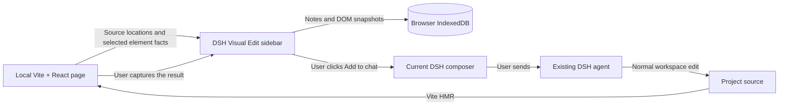

# Architecture

Visual Edit has two entry points in one package. The DSH plugin owns feedback and review. The Vite plugin adds a development-only inspector to the web app.

## DSH integration

`src/index.ts` provides an empty host `apply()`. `src/client/index.tsx` registers a right-sidebar tab, a guide entry, and an existing-conversation header action through DSH's public slot services. Registrations are owned by `ctx.effect` and are removed with the plugin. React comes from the DSH module loader. The browser build has a hard 262,144-byte size gate.

The tab requests `keepMounted` so hiding it does not intentionally reload the iframe. Each `sessionId` has its own React board, records, and preview configuration. Native composer insertion uses `captureInsertion()` followed by `insertText()`. It collapses the selected span to an insertion point, preserving selected text and unrelated draft content. Submission remains an ordinary DSH action.

## Source mapping

The Vite plugin parses local `.jsx` and `.tsx` files before React transforms them. It adds a `data-dsh-ve-source` attribute to lowercase DOM tags using an AST and MagicString, with a source map. Custom component tags are not annotated. `node_modules`, files outside Vite's root, and non-JSX files are excluded. Physical source files are never rewritten by the plugin.

The metadata contains a relative path, line, and column. A nested element can inherit the nearest annotated ancestor's source location; it is a starting point for the agent to inspect, not a declaration that a CSS rule is defined at that line. CSS rule provenance is not included.

The plugin uses `apply: 'serve'`. It serves a local inspector script and inserts a script tag into the development HTML. It does not proxy the website. Relative API requests continue to resolve against the app's own origin.

## Bridge and element matching

The parent validates `event.source`, the configured preview origin, the protocol, a random connection channel, and bounded snapshot data. The inspector accepts only messages from `window.parent`, an exact allowlisted DSH origin, and the active channel. Connection retries and capture requests have timeouts. React teardown clears message listeners, timers, and pending captures.

The inspector prefers a unique ID, then a unique `data-testid`, then a unique DOM path. A result capture requires the same full-URL hash and viewport. It verifies the target's tag, ID/test ID, and source file. Without a stable ID/test ID, the source line and column must still match. Reordered data-driven lists can reuse both a DOM position and a JSX source location; stable business IDs remain the app author's responsibility.

## Snapshots

`html-to-image` renders a selected DOM element to a PNG. It retains the element's own background while compositing against the body background. It omits form/editable/private descendants and does not embed web fonts. Oversized elements, excessive image data, disconnected nodes, and rendering failures produce visible errors or metadata-only captures.

PNG data is local. Agent feedback contains a human request and labeled reference data: public URL path, viewport, source location, selector, text, and a small set of computed styles. Page content is explicitly labeled as untrusted reference data. URL query/hash values and PNG bytes are omitted.

## Storage and state

IndexedDB `dsh-visual-edit-v1` contains `notes` (key: session + note ID) and `boards` (key: session). Notes use optimistic revision checks in a read/write transaction. A stale writer aborts and reloads the latest record. A `BroadcastChannel` tells other tabs to refresh. Fifty notes per session limit storage growth; each snapshot has an independent image-size cap.

States have narrow meanings:

| State | Meaning |
|---|---|
| Draft | A feedback record was saved or edited |
| Added to composer | Text was successfully inserted into the native draft |
| Needs review | A current element snapshot was recorded |
| Confirmed | The user accepted the recorded result |

Editing a note clears its previous result and preserves its original baseline. Capturing a result replaces the previous result for that note. The product is a two-snapshot review board, not a version-control system or an unlimited screenshot history.

Export is a local JSON download containing notes and images. There is no import or cloud synchronization in v0.1. Removing the plugin does not delete browser data. Deleting a note removes its two stored snapshots.
