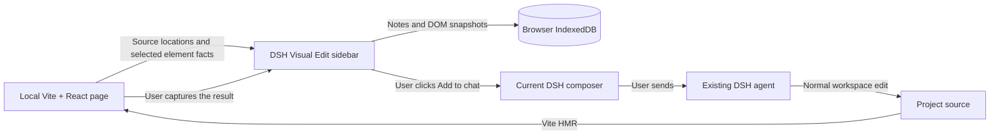

# Architecture

Visual Edit has two entry points in one package. The DSH plugin owns feedback and review. The Vite plugin adds a development-only inspector to the web app.

## DSH integration

`src/index.ts` provides an empty host `apply()`. `src/client/index.tsx` registers a right-sidebar tab, a guide entry, and an existing-conversation header action through DSH's public slot services. Registrations are owned by `ctx.effect` and are removed with the plugin. React comes from the DSH module loader. The browser build has a hard 262,144-byte size gate.

The tab requests `keepMounted` so hiding it does not intentionally reload the iframe. Each `sessionId` has its own React board, records, and preview configuration. Native composer insertion uses `captureInsertion()` followed by `insertText()`. It collapses the selected span to an insertion point, preserving selected text and unrelated draft content. Submission remains an ordinary DSH action.

The UI consumes DSH's font, color, radius, and interaction tokens, including its explicit theme preference. Preview and Feedback share a mounted iframe. Capture temporarily reveals the preview because Chromium suspends animation frames in hidden iframes; it returns to Feedback on completion or failure. The capture action locks view changes and page interaction while it runs. The standalone test adapter declares a small set of theme tokens; it does not inject those into DSH.

Snapshot comparison uses a native modal dialog with keyboard dismissal and focus restoration. Overlay mode aligns stored images at the top left and preserves their relative dimensions. It neither recaptures the page nor uploads images.

## Source mapping

The Vite plugin parses local `.jsx` and `.tsx` files before React transforms them. It adds a `data-dsh-ve-source` attribute to lowercase DOM tags using an AST and MagicString, with a source map. Custom component tags are not annotated. `node_modules`, files outside Vite's root, and non-JSX files are excluded. Physical source files are never rewritten by the plugin.

The metadata contains a relative path, line, and column. A nested element can inherit the nearest annotated ancestor's source location; it is a starting point for the agent to inspect, not a declaration that a CSS rule is defined at that line. CSS rule provenance is not included.

The plugin uses `apply: 'serve'`. It serves a local inspector script and inserts a script tag into the development HTML. It does not proxy the website. Relative API requests continue to resolve against the app's own origin.

## Bridge and element matching

The parent validates `event.source`, the configured preview origin, the protocol, a random connection channel, and bounded snapshot data. The inspector accepts only messages from `window.parent`, an exact allowlisted DSH origin, and the active channel. Connection retries and capture requests have timeouts. React teardown clears message listeners, timers, and pending captures.

The inspector prefers a unique ID, then a unique `data-testid`, then a unique DOM path. A result capture requires the same full-URL hash and viewport. It verifies the target's tag, ID/test ID, and source file. Without a stable ID/test ID, the source line and column must still match. Reordered data-driven lists can reuse both a DOM position and a JSX source location; stable business IDs remain the app author's responsibility.

## Snapshots

`html-to-image` renders a selected DOM element to a PNG. It retains the element's own background while compositing against the body background. It omits form/editable/private descendants and does not embed web fonts. Oversized elements, excessive image data, disconnected nodes, and rendering failures produce visible errors or metadata-only captures.

PNG data is local. Agent feedback contains a human request and labeled reference data: public URL path, viewport, source location, selector, text, and a small set of computed styles. Page content is explicitly labeled as untrusted reference data. URL query/hash values and PNG bytes are omitted.

## Storage and state

IndexedDB `dsh-visual-edit-v1` contains `notes` (key: session + note ID) and `boards` (key: session). Notes use optimistic revision checks in a read/write transaction. A stale writer aborts and reloads the latest record. A `BroadcastChannel` tells other tabs to refresh. Fifty notes per session limit storage growth; each snapshot has an independent image-size cap.

The editor keeps the revision from the moment editing began, separate from the refreshed list. A broadcast cannot silently update that revision and overwrite newer content. Conflicts retain unsaved text and require an explicit reload before saving. A synchronous action lock prevents repeated in-flight writes. Composer insertion checks the note revision before writing and reports separately if the text was inserted but saving its status failed. Notes retain their original creation order when their status changes. Version 0.2.0 retains the 0.1.0 storage schema and bridge protocol.

Version 0.3.0 uses the same schema and protocol. Batch selection retains full selected revisions; a broadcast does not replace these with newer notes. The source-linked prompt contains one shared instruction block. `queueNotes()` checks and updates every selected record inside one IndexedDB transaction. A single stale revision aborts the whole status update. Composer insertion remains outside that transaction, so the UI explicitly reports an inserted prompt whose status update failed.

States have narrow meanings:

| State | Meaning |
|---|---|
| Draft | A feedback record was saved or edited |
| Added to composer | Text was successfully inserted into the native draft |
| Needs review | A current element snapshot was recorded |
| Confirmed | The user accepted the recorded result |

Editing a note clears its previous result and preserves its original baseline. Capturing a result replaces the previous result for that note. The product is a two-snapshot review board, not a version-control system or an unlimited screenshot history.

Export is a local JSON download containing notes and images. The 0.3.0 importer accepts the same `dsh-visual-edit/v1` format used by prior versions. It checks the 70 MB file limit, note bounds and uniqueness, status/date/source metadata, comparison compatibility, and PNG signature/IHDR dimensions before presenting a preview. Only known fields enter storage; URL query/hash values are removed from imported snapshots and from generated feedback. The parser does not fetch referenced pages or images.

`importNotes()` reads the destination session and adds new IDs in one read/write transaction. Existing IDs are skipped, the 50-note limit is checked against the current records, and any failure aborts the entire import. Imported revisions start at zero. Queued records become drafts because the target composer is independent of the backup; other recorded review states and images remain. Preview configuration is not imported. There is no cloud synchronization. Removing the plugin does not delete browser data. Deleting a note removes its two stored snapshots after an inline confirmation.
