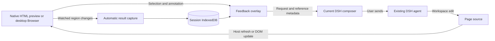

# Architecture

The package provides a DSH client plugin, an optional Vite development bridge, and a bundled inspector. The host `apply()` registers no model tools and reads no workspace files.

## Native integration

`native-integration.tsx` shadows the public keyed document and Browser body slots at a higher priority, forwarding the original component's store, locale, and injections. `ctx.on("slots/changed")` handles late registrations. Disposing the plugin removes its registrations and controllers; no host application files are changed. React is supplied by DSH. The client bundle has a hard 262,144-byte gate.

HTML contributes its toolbar action through `sidebar.right.tab.document.action`. The Browser wrapper places its action beside the existing address toolbar. No conversation-header action is registered. The optional standalone Vite tab remains a compatibility entry.

One `NativeSession` is owned by the session ID and sidebar tab ID, independently of renderer mounts. HTML loading can replace its React body and iframe; the feedback controller, selected mode, unsaved selection, and monitoring survive until the tab's abort signal. Saving/cancelling consumes the selection so it cannot reappear after a reload and block result capture.

HTML is instrumented in memory with original relative file/line/column locations. Interactive mode forwards the prepared bytes to the host renderer and retains its resource handling and permissions. Static mode sanitizes the HTML and uses an opaque sandbox with a nonce policy allowing only the bundled inspector. The page's own scripts remain blocked.

The desktop Browser uses the existing Electron webview's `executeJavaScript`, with a random API key, channel, exact page URL guard, navigation generation, and bounded event queue. A main-frame navigation invalidates pending work. Loading the new document rearms monitoring. A small polling loop retrieves inspector events only while the tab is visible and editing or monitoring is active.

## Selection and images

Element selection uses a unique ID, unique test ID, or bounded CSS path. Locator validation also checks the tag and available source identity. Native unique selectors without positional pseudo-classes tolerate moved source lines; ambiguous positional identities still fall back. When native capture cannot establish the original element, it captures the original document region and sets an explicit fallback flag. Changed viewport dimensions are allowed in native mode and labeled. Legacy iframe mode retains its strict URL/viewport/element checks.

Arrow and rectangle gestures record document coordinates. An arrow also records the endpoint's element locator. `annotation.ts` crops the page DOM into the selected region while preserving original layout dimensions, then draws the annotation. Native element snapshots use a page crop too, retaining ancestor backgrounds so light text on gradients stays visible. Computed animation/transition appearance is frozen inside the image clone so entrance animations do not restart invisibly. Output is capped at 1600 pixels per dimension and 650,000 data-URL characters.

Snapshots omit form/editable/private descendants and skip external web fonts. Rendering failure retains available metadata with an explanation. They are DOM renders, not pixel-exact screenshots; child iframes, Shadow DOM, canvas/WebGL and remote resources have limits.

## Automatic comparison

After composer insertion succeeds, notes become queued. The controller reads queued/review records for the current page, then sends only these targets to the inspector. A debounced mutation observer computes bounded fingerprints of selected subtrees or regions: direct text, geometry, computed styles and image references. Overlay mutations and private content are excluded. Changes outside the selected target do not request its capture.

A changed fingerprint emits target IDs. The controller serializes captures, retains the original baseline, and saves the latest after snapshot using the note's expected revision. Confirmed/deleted/edited notes cannot be overwritten by a stale capture. BroadcastChannel updates the visible board and other clients. The view moves to the updated comparison; manual result capture uses the same controller and remains available.

Monitoring is page scoped, pauses when the preview is hidden, and stops for confirmed notes. It responds to DOM/file refreshes, not an inferred model-completion signal. A runtime error is shown and the next page change/reload or manual capture can retry.

## Composer and storage

The one-click action saves the feedback, calls DSH's `captureInsertion()` and `insertText()`, then queues the saved revision. It preserves existing draft text and does not send the conversation automatically. If insertion succeeds but storing the queued state fails, the UI reports that distinction to avoid duplicate insertion.

IndexedDB `dsh-visual-edit-v1` stores notes by session and ID, plus legacy preview configuration. Updates use revision checks; batches and restores use atomic transactions. The 50-note/session limit bounds growth. No cloud storage is introduced.

Backups retain the v1 format with optional annotation, scroll, fingerprint, viewport-change, and fallback fields. Validation bounds points/regions and checks image signature/IHDR dimensions before decoding. Only known fields enter storage. Duplicate IDs are skipped; imported queued notes become drafts. Restoring never opens referenced pages or submits requests.

## Boundaries

Opaque HTML frames are accepted only from their exact window, null origin and random channel. The legacy Vite bridge requires its configured parent origin; the standalone preview permits only loopback HTTP(S) pages on a different origin from DSH. Snapshot references may also represent native DSH file-resource addresses without granting new filesystem access.

Agent feedback includes user requests and labeled reference data: public URL path, viewport, source, locator, text, selected styles, annotation and bounds. It excludes PNG bytes and URL query/hash values. Page text is explicitly identified as reference data rather than instructions.

The Vite plugin annotates JSX/TSX through the normal development transform using Babel and MagicString; it excludes dependencies and files outside the project root. It never rewrites source files. Production builds contain neither the bridge nor its source markers.
