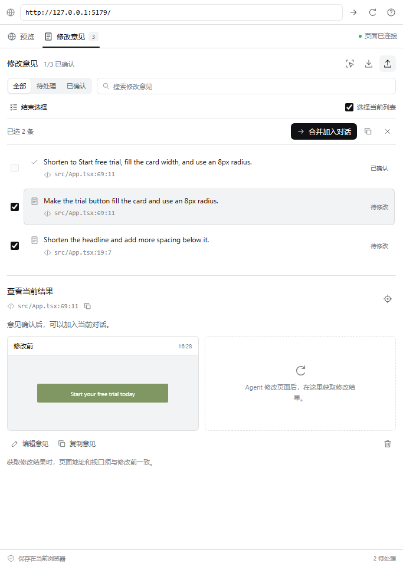
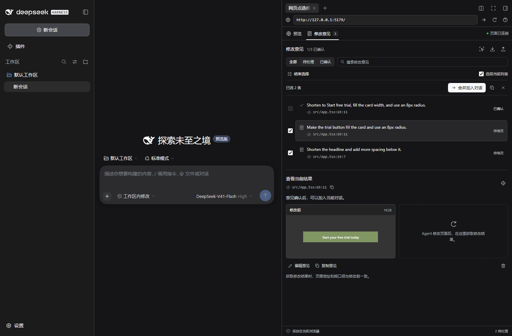
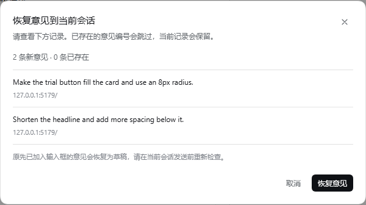

# 界面设计与交互

0.3.0 的界面按 DSH 0.2.0-rc.2 的侧栏组织。预览、修改意见、备份恢复和图片比较共用 DSH 的颜色、字体、圆角和控件尺寸，插件内部不重复展示品牌标题。

## 与宿主保持一致

| 部分 | 实现 |
|---|---|
| 颜色 | 使用 `--dsw-alias-bg-*`、`--dsw-alias-label-*`、边框和交互颜色变量 |
| 主按钮 | 使用 DSH 的黑白主按钮变量；蓝色只用于焦点、连接操作等语义状态 |
| 外观切换 | 跟随 DSH 实际设置，不用独立的操作系统媒体查询覆盖宿主主题 |
| 字体 | 继承 DSH 的系统字体和代码字体，包括中文回退字体 |
| 控件 | 图标按钮 28px、细边框、8px 小圆角，与原生浏览器工具栏接近 |
| 布局 | 顶部地址栏与页签固定，中间内容滚动，底部显示本地保存状态 |
| 窄侧栏 | 在 400px 以下调整筛选区和前后图片排列；已检查 340px 侧栏 |

这些样式引用宿主变量，不复制或覆盖 DSH 的全局主题。回退颜色只用于独立开发与测试页面。界面使用标准按钮、输入框和对话框，支持键盘焦点、页签方向键、减少动画设置和 `Esc` 关闭图片比较。

## 两个视图

“预览”用于操作网页、切换桌面或手机视口、点选元素和填写意见。“修改意见”用于搜索、筛选、发送、比较和确认。切换视图保留同一个 iframe；意见按建立基准的时间排列，状态更新不会把列表重新排序。

保存意见后进入意见页，主操作随当前状态变化。获取结果时短暂显示预览，等待图片生成后回到意见页。这是因为 Chromium 会暂停隐藏 iframe 中的动画帧，而图片生成依赖这些帧；直接在隐藏页面中获取图片会超时。

## 图片与编辑

点击快照打开较大的比较窗口。叠加模式按左上角对齐，并保留两张图片的相对尺寸；滑块调整修改结果的可见范围。这里显示的是已经保存在浏览器中的图片，不发起额外网络上传。

删除意见前在当前条目内确认。编辑过程中保留开始编辑时的版本号；其他窗口更新同一意见时显示冲突，保留未保存文字，禁止覆盖新版本。“读取最新意见”是明确替换编辑内容的操作。

## 连续记录与批量选择

新增意见时，“保存并继续点选”会保留网页状态，立即进入下一次点选。普通保存仍进入意见页，方便处理单个问题。

批量选择按需展开，显示复选框、选择数量与“合并加入对话”。这时收起单条意见的发送和获取结果按钮，让主操作保持明确。退出批量选择或切回预览后恢复单条操作。340px 侧栏中，批量工具栏会换行排列。

选择当前列表只包括筛选结果中未确认的意见。勾选时保存内容版本；其他窗口修改了所选意见，就显示说明并暂停加入对话，直到用户重新选择。这样可以先检查新内容，再决定发送。

## 备份恢复

恢复入口放在导出按钮旁边，延续 28px 图标按钮样式。选择 JSON 后，600px 宽的居中窗口先展示新增数量、重复数量、意见和页面地址；小屏幕下按可用宽度缩小。

恢复前支持取消和 `Esc` 关闭。写入失败时在窗口内显示原因，保持预览可见。已有编号直接跳过；原先加入过输入框的意见恢复为待修改状态，避免将来源会话的状态误当成当前会话的状态。

## 实际界面

截图来自真实 DSH Web。详细运行环境和功能验证范围见[验证记录](validation.md)。
