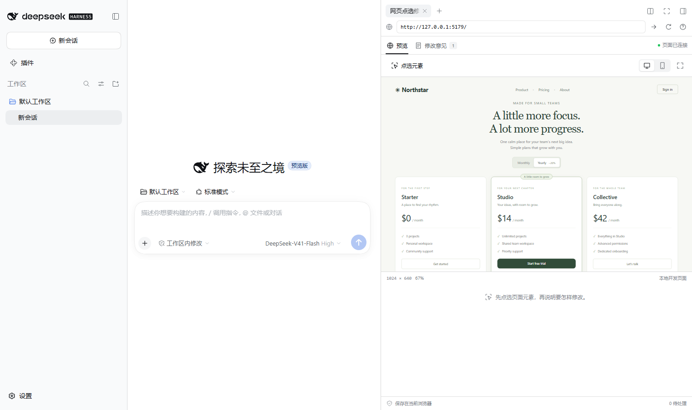
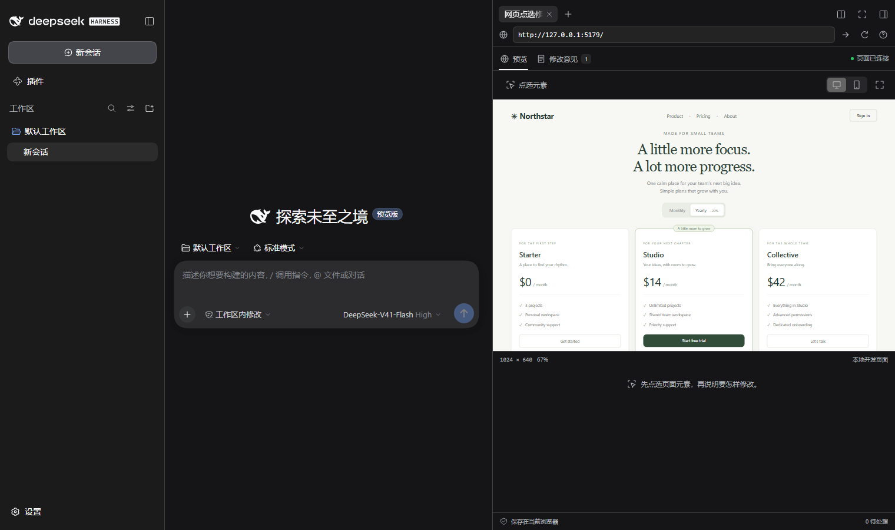
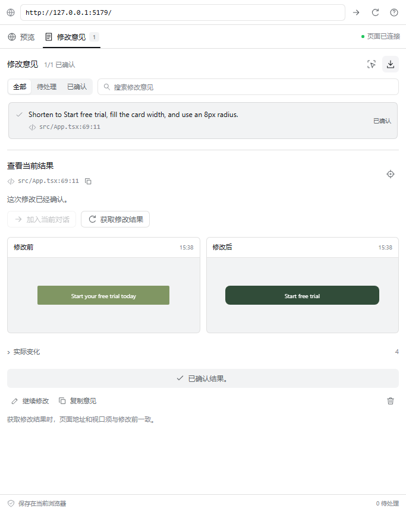

# 界面设计与交互

0.2.0 的界面按 DSH 0.2.0-rc.2 的侧栏组织。预览、修改意见和图片比较共用 DSH 的颜色、字体、圆角和控件尺寸，插件内部不再重复展示品牌标题。

## 与宿主保持一致

| 部分 | 实现 |
|---|---|
| 颜色 | 使用 `--dsw-alias-bg-*`、`--dsw-alias-label-*`、边框和交互颜色变量 |
| 主按钮 | 使用 DSH 的黑白主按钮变量；蓝色只用于焦点、连接操作等语义状态 |
| 外观切换 | 跟随 DSH 实际设置，不用独立的操作系统媒体查询覆盖宿主主题 |
| 字体 | 继承 DSH 的系统字体和代码字体，包括中文回退字体 |
| 控件 | 图标按钮 28px、细边框、8px 小圆角，与原生浏览器工具栏接近 |
| 布局 | 顶部地址栏与页签固定，中间内容滚动，底部显示本地保存状态 |
| 窄侧栏 | 在 400px 以下调整筛选区和前后图片排列；已检查 340px 侧栏 |

这些样式引用宿主变量，不复制或覆盖 DSH 的全局主题。回退颜色只用于独立开发与测试页面。界面使用标准按钮、输入框和对话框，支持键盘焦点、页签方向键、减少动画设置和 `Esc` 关闭图片比较。

## 两个视图

“预览”用于操作网页、切换桌面或手机视口、点选元素和填写意见。“修改意见”用于搜索、筛选、发送、比较和确认。切换视图保留同一个 iframe；意见按建立基准的时间排列，状态更新不会把列表重新排序。

保存意见后进入意见页，主操作随当前状态变化。获取结果时短暂显示预览，等待图片生成后回到意见页。这是因为 Chromium 会暂停隐藏 iframe 中的动画帧，而图片生成依赖这些帧；直接在隐藏页面中获取图片会超时。

## 图片与编辑

点击快照打开较大的比较窗口。叠加模式按左上角对齐，并保留两张图片的相对尺寸；滑块调整修改结果的可见范围。这里显示的是已经保存在浏览器中的图片，不发起额外网络上传。

删除意见前在当前条目内确认。编辑过程中保留开始编辑时的版本号；其他窗口更新同一意见时显示冲突，保留未保存文字，禁止覆盖新版本。“读取最新意见”是明确替换编辑内容的操作。

## 实际界面

截图来自真实 DSH Web。详细运行环境和功能验证范围见[验证记录](validation.md)。
